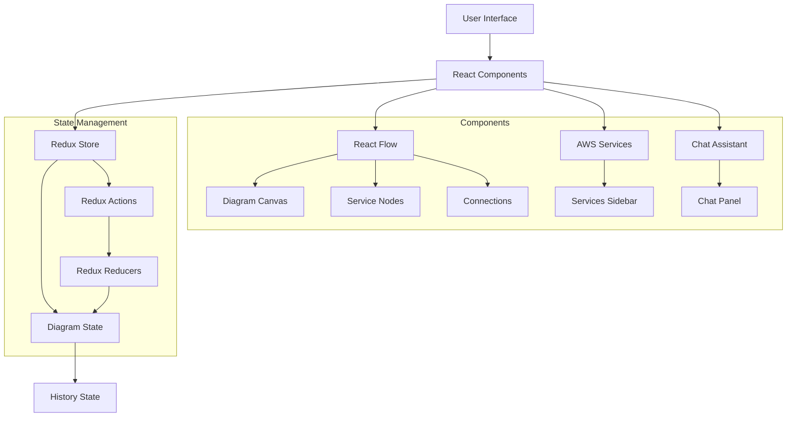
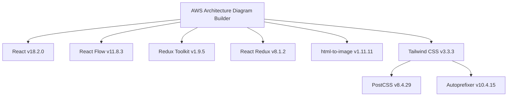
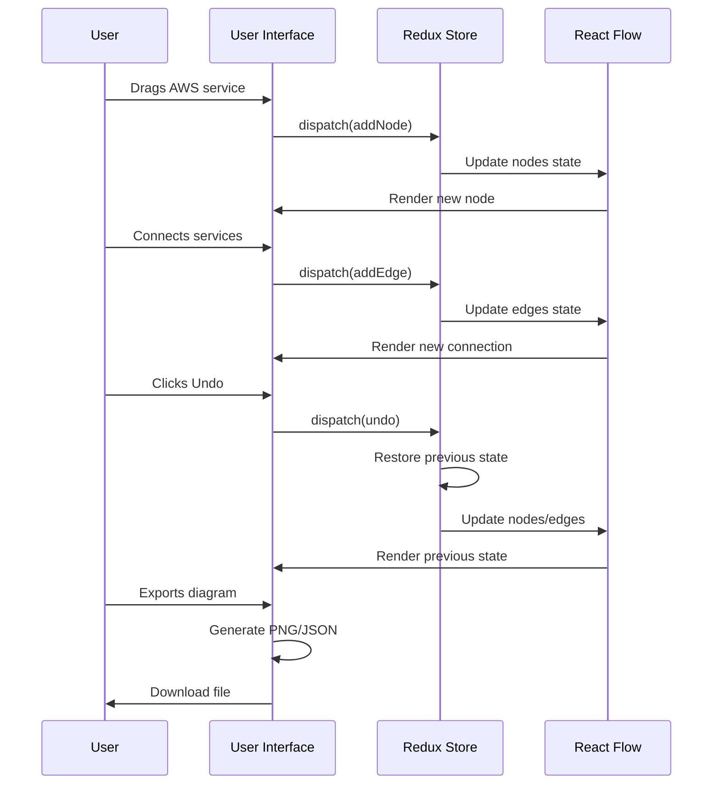
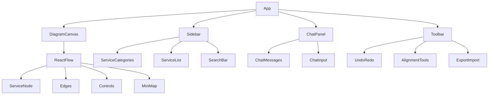

# AWS Architecture Diagram Builder


A powerful, interactive tool for creating AWS architecture diagrams with a user-friendly interface, built with React Flow and Redux.


## 📋 Features

- [x] Drag-and-drop AWS service icons to create diagrams
- [x] Connect services with smoothly styled edges
- [x] Multi-select and alignment tools for precise layouts
- [x] AI-powered chat assistant for quick service search and actions
- [x] Export diagrams as PNG images
- [x] Import/Export diagram as JSON
- [x] Undo/Redo functionality
- [x] Trash bin for easy node deletion
- [x] Collapsible sidebar panels for maximum workspace
- [x] Service categorization for easy discovery
- [x] Interactive MiniMap with toggle control

## 🔍 Architecture Overview



## 🚀 Getting Started

### Prerequisites

- Node.js 14.x or higher
- npm 6.x or higher

### Installation

```bash
# Clone the repository
git clone https://github.com/albingcj/reactflow-architecture-editor.git
cd reactflow-architecture-editor

# Install dependencies
npm install

# Start development server
npm start
```

## 📦 Dependencies



## 🛠️ Project Structure

```
reactflow-architecture-editor/
├── public/
│   ├── index.html
│   └── favicon.ico
├── src/
│   ├── assets/
│   │   └── aws-services.json   # AWS service icons mapping
│   ├── components/
│   │   ├── DiagramCanvas/      # Main diagram area
│   │   ├── NodeTypes/          # Custom node components
│   │   ├── Sidebar/            # AWS services sidebar
│   │   ├── ChatPanel/          # AI assistant panel
│   │   └── Toolbar/            # Action toolbar
│   ├── hooks/                  # Custom React hooks
│   ├── store/                  # Redux store configuration
│   ├── utils/                  # Helper functions
│   ├── App.jsx                 # Main application component
│   └── index.js                # Application entry point
└── tailwind.config.js          # Tailwind CSS configuration
```

## 🖱️ Usage Guide

### Creating a Diagram

1. Browse AWS services in the left sidebar
2. Drag services onto the canvas
3. Connect services by dragging from one connection point to another
4. Use the alignment tools when multiple nodes are selected

### Using the Chat Assistant

The chat assistant supports commands like:
- `find database` - Search for database services
- `add EC2` - Add an EC2 instance to the diagram
- `undo` - Undo the last action
- `clear` - Clear the entire diagram


### Keyboard Shortcuts

| Shortcut | Action |
|-------------|---------------------------|
| Ctrl+Z | Undo |
| Ctrl+Y | Redo |
| Delete | Remove selected elements |
| Shift+Click | Select multiple nodes |
| Ctrl+A | Select all nodes |

## 🔄 Workflow



## 🧩 Component Hierarchy



## 🔌 State Management

The application uses Redux for state management with the following main slices:

- **Diagram Slice**: Manages nodes, edges, and diagram history
- **UI Slice**: Manages UI state like sidebar collapse, selected tabs, etc.

## 🛣️ Roadmap

- [ ] Responsive design for mobile and tablet devices
- [ ] Custom themes and diagram styling options
- [ ] AWS cost estimation based on selected services
- [ ] Architecture validation based on AWS best practices
- [ ] Presentation mode for clean diagram viewing
- [ ] Accessibility improvements
- [ ] LLM integration with chat assistant

## 🤝 Contributing

Contributions are welcome! Please feel free to submit a Pull Request.

1. Fork the repository
2. Create your feature branch (`git checkout -b feature/feature_Azure`)
3. Commit your changes
4. Push to the Dev branch
5. Open a Pull Request

## 🙏 Acknowledgments

- [React Flow](https://reactflow.dev/) for the powerful diagram framework
- [Redux Toolkit](https://redux-toolkit.js.org/) for state management
- [Tailwind CSS](https://tailwindcss.com/) for styling

---

Made with ❤️ by [Albin](https://albingcj.com)
